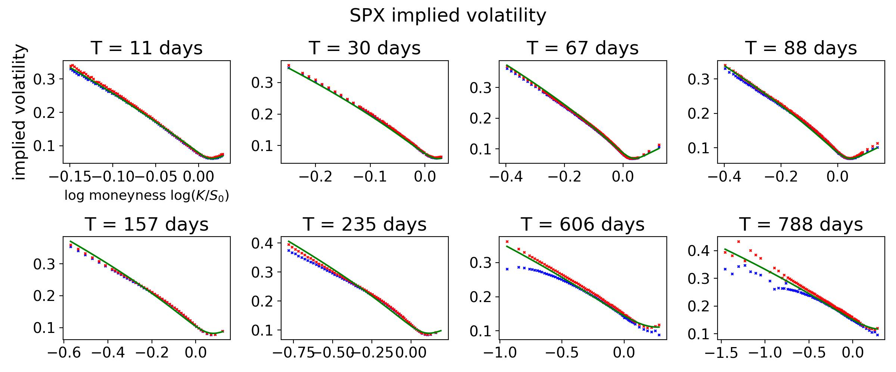
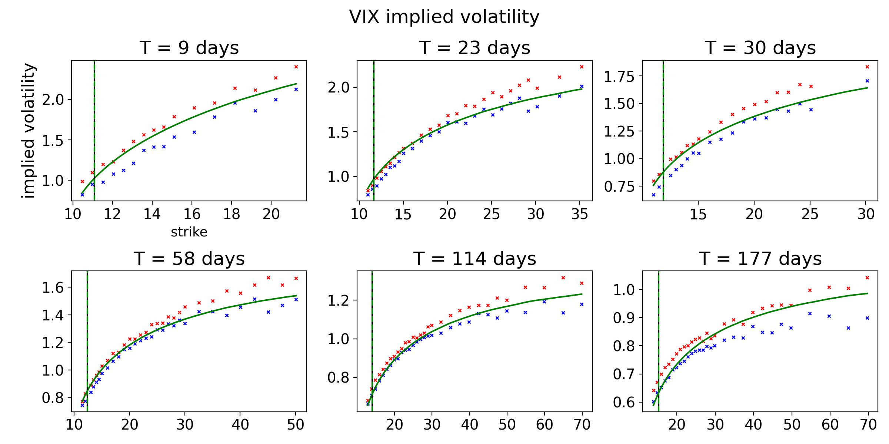

# Capturing Smile Dynamics with the Quintic Volatility Model: SPX, Skew-Stickiness Ratio and VIX

Eduardo Abi Jaber, Ecole Polytechnique, CMAP

Shaun (Xiaoyuan) Li, Université Paris 1 Panthéon-Sorbonne, CES

Implementation of the two-factor Quintic OU model

The two-factor Quintic OU stochastic volatility model is described as

$$
dS_t = S_t\sigma_t \left(\rho dW_t + \sqrt{1-\rho^2} dW^{\perp}_t \right), \quad S_0>0,
$$

$$
\sigma_t = g_0(t)p(Z_t), \quad p(z) = \sum_{k=0}^5\alpha_k z^k, \quad Z_t =  \theta X_t+(1 - \theta)Y_t,
$$

$$
X_t = \int_0^t e^{-\lambda_x(t-s)}dW_s, \quad Y_t = \int_0^t e^{-\lambda_y(t-s)}dW_s,
$$

where $B=\rho W + \sqrt{1-\rho^2} W^{\perp}$, $(W,W^{\perp})$ a two-dimensional Brownian motion. The two-factor Quintic OU model has the following model parameters

$$
(\lambda_x, \lambda_y, \theta, \rho, \alpha_0, \alpha_1, \alpha_2, \alpha_3, \alpha_4, \alpha_5),$$

with $\rho \in [-1,1]$, $\lambda_x, \lambda_y >0$, $\theta \geq 0$, $\alpha_k \in \mathbb{R}$.

Constructed using two OU processes, The $\mbox{VIX}^2$ is polynomial in $(X, Y)$ allowing fast computation of VIX derivatives via numerical integration (e.g.~quantization of multivariate Gaussian). Simulation of $\sigma_t$ and $\mbox{VIX}_t$ is exact, simulation of $logS_t$ is also straightfoward.  

The two-factor Quintic OU model can fit to the joint SPX-VIX volatility surfaces, while remaining consistent with the observed SSR range over several maturities. Here are some sample fits:

#### SPX term structure 6 May 2024

#### Joint SPX & VIX volatility surfaces and SSR 23 October 2017

